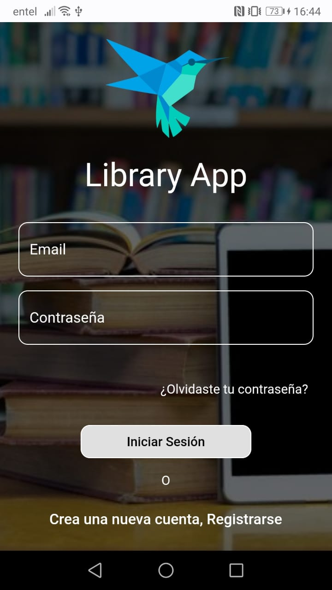
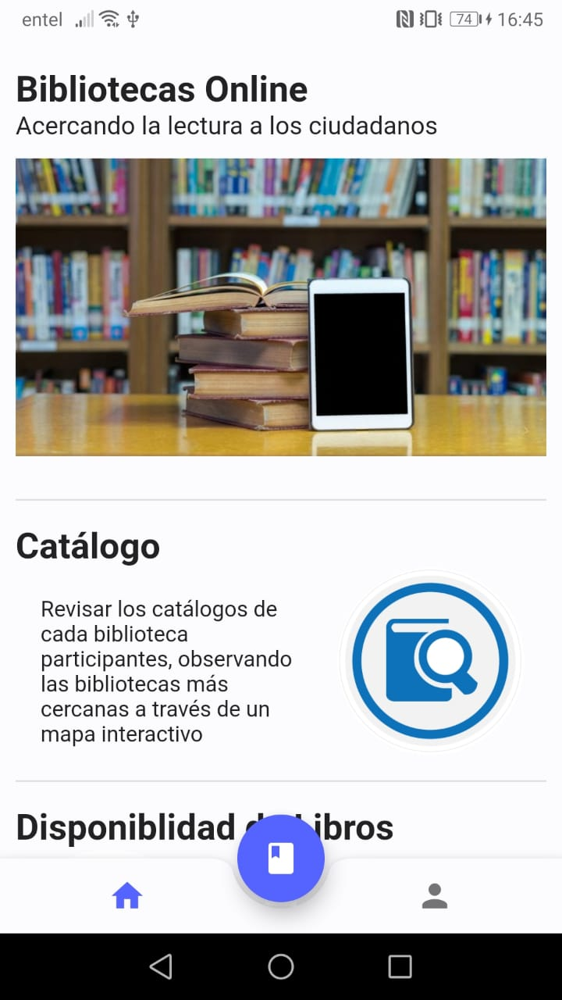
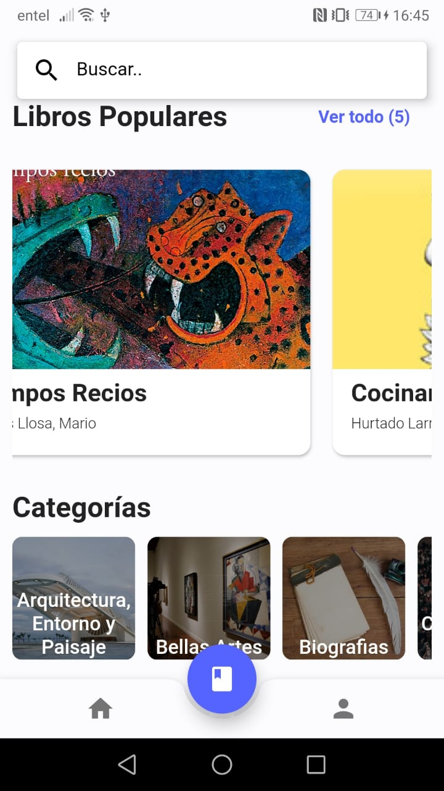
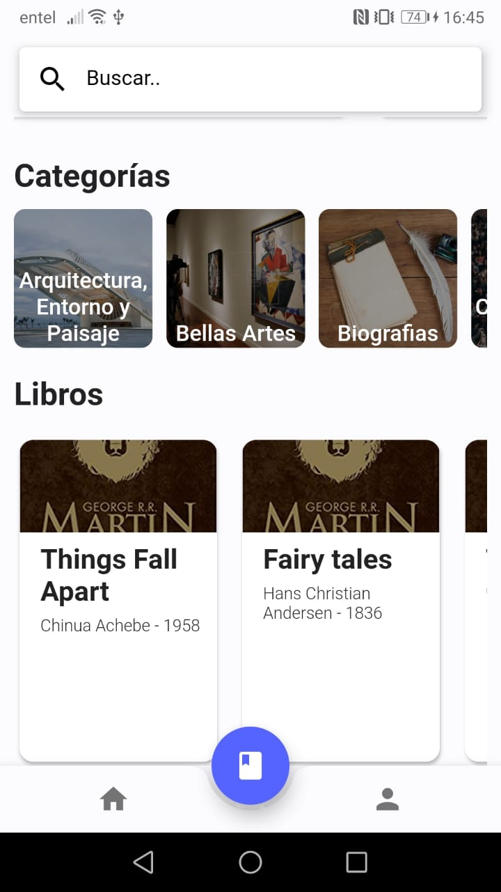
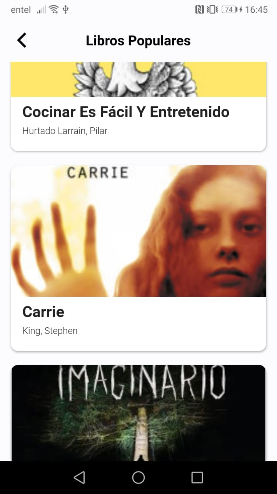
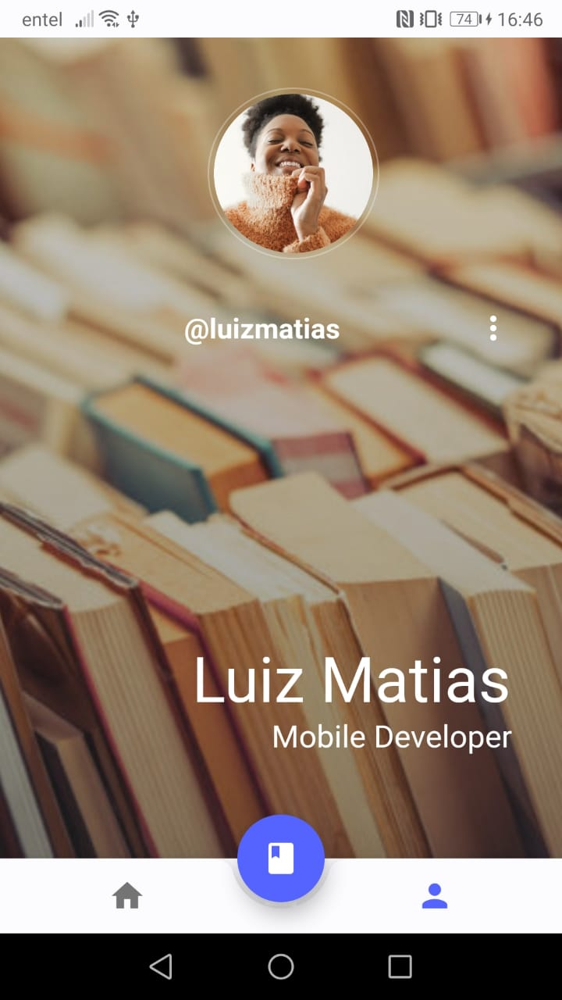

# LIBRARY APP

Proyecto Flutter.

## Proyecto Librerias públicas

El presente proyecto aborda la necesidad de generar una aplicación móvil, que permita la visualización de los libros disponibles en la actualidad en las diferentes bibliotecas involucradas en el proyecto. Además, de permitir solicitar la prestación de un libro de manera remota.

*El alcance actual de este proyecto aborda la UI (user interface) de la aplicación móvil a utilizar.*

## Interfaz

            
            

## Como comenzar

Algunos recursos para comenzar si no sabe manejar Flutter:

- [Laboratorio: Escribe tu primera aplicación Flutter] (https://flutter.dev/docs/get-started/codelab)
- [Libro de muestra: muestras útiles de Flutter] (https://flutter.dev/docs/cookbook)

Para obtener ayuda para comenzar a usar Flutter, vea la
documentación en línea (https://flutter.dev/docs), que ofrece tutoriales, ejemplos, orientación sobre desarrollo móvil y una referencia API completa.
"# library_app" 
